# Pick Your Bot
## Motivation and Summary
Our goal was to create a pool of strategies using different Price Indicators to execute an order to enter in a Long position, and to implement sentiment analysis into our strategy as well as these technical indicators.
The technical strategies have been built using Simple Moving Average (SMA), and Bollinger Bands (BB).
We are going to use the strategy that presents the best evaluation Metrics and cumulative return for our basket of chosen stocks. 

## Strategies Evaluated
* SMA 
* Bollinger Bands
* Sentiment Analysis

## S&P Stocks Evaluated
* APL, 
* XOM
* CMG
* TSLA
* WMT
* GOOG

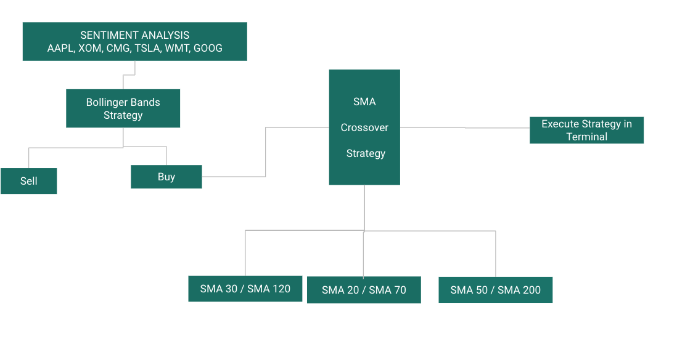

# Simple Moving Average
Simple Moving Average, SMA, is a technical indicator that can aid in determining if an asset price will continue or if it will reverse a bull or bear trend. It calculates the average of a selected range of prices, usually closing prices, by the number of periods in that range by adding recent prices and then dividing that figure by the number of time periods in the calculation average.
The Formula for SMA is:
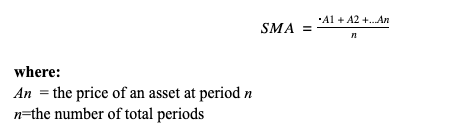

## Method
* Fetc data for Daily Closing stock prices from Yahoo Finance and save as a .csv
* Generate the slow and fast SMA (50 and 200 respectively)
* General the trading signal 1 or 0
*Calculate the points in time at which a position should be taken, 1 or -1
* Backtest and Evaluation by adding a cash amount to the portfolio and testing the strategy. 
* Calculate portfolio daily and cumulative returns
* Use Returns, Volatility, Sharpe Ratio, and Sortino Ratio to measure performance
* Get Results:
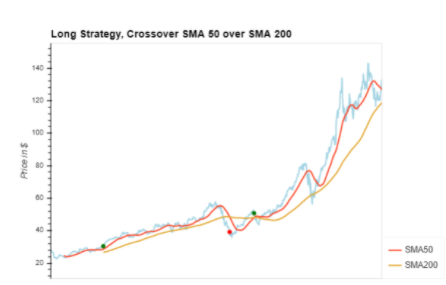
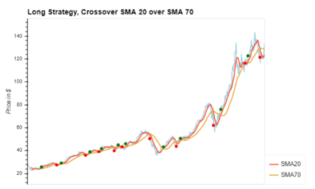
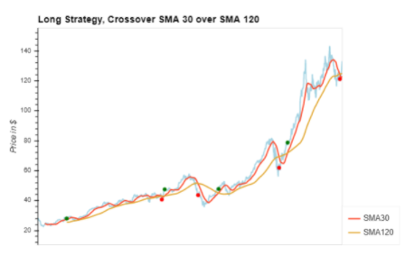
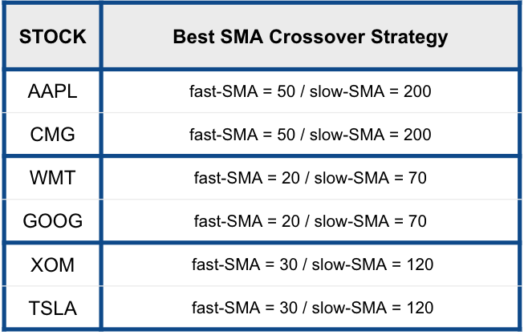

# Bollinger Bands
The Bollinger Bands are a technical analysis tool used to evaluate the volatility of of a specific stock.

When the Bollinger bands are configured a 20-day SMA is used for the middle band and two bands one above and one below are also added. These outer bands are 2 standard deviations away from the SMA. When the stock is overbought you see the price ove along the upper band and it is indicative of a sell signal for the buy signal price will move along the lower band.

## Method
* Import CSV from Yahoo Finance
* Create parameters for Bollinger Bands
* Set up plot of Bollinger Bands with Closing prices from stock data
* Configure Xtick on the plot

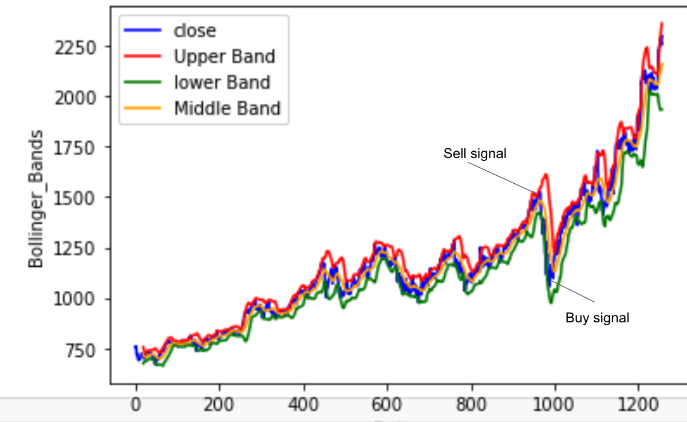

# Sentiment Analysis
Sentiment analysis is the process of detecting positive or negative sentiment in text. 

We aimed to discover future trend of a stock by considering news articles about a company as prime information and trying to classify news as good or bad. 

The idea is that if the news sentiment is positive, there are more chances that the stock price will go up and if the news sentiment is negative, then stock price may go down. 

If we can predict the news sentiment, you would be able to form a position with that knowledge.

## Method
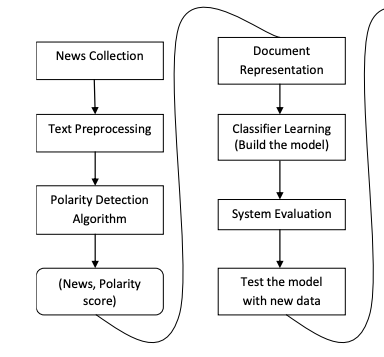
* News collectino- this proved to be the most important and most difficult step. We gathered financial article headlines from the URL FinViz for each of our 6 tickers and then used the Beautiful Soup Library to scrape financial info from the website.
* We then parsed the data so the VADER Sentiment Analyzer could evaluate the headlines for sentiment
* Model Evaluation- we used a custom RNN LSTM model to predict polarity. The training data for the model was the Vader dataframe
* Evalution Metrics
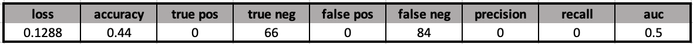
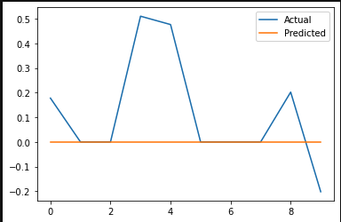

## Sentiment Analysis Postmortem
* Spend more time collecting data, making sure that the dates match up with the historical prices that were pulled for the technical indicators (5 years as opposed to only a month or so of articles from FinViz). This is due to the nature of pulling from FinViz, which has updated articles by the minute
* Be more specific with the text pulled. For example, update the Vader lexicon to include stock market speciifc words, retrieve the actual article as opposed to the headline because we know headlines are misleading, apply weights to certain news sources, and include more sources like social media
* Would close the gap between sentiment analysis and stock part close prices, plotting the time series of past close prices, plot the scoring of the news sentiment, and observe the relationship between news sentiment and stock price as seen in the end of this flow from earlier:

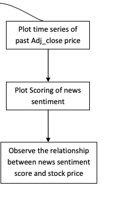